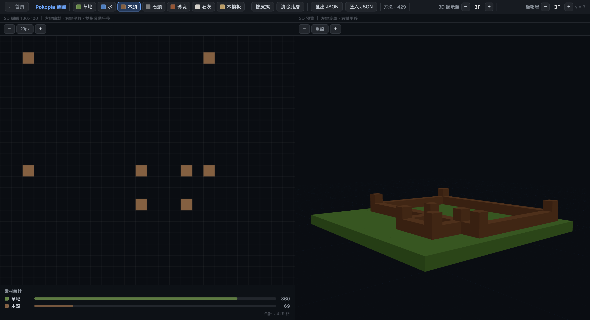

# Pokopia Blueprint Editor
***🚧 Work in Progress — This project is under active development.***

**[Live Demo](https://pokopia-tools.netlify.app/)**

A web-based grid blueprint tool for planning block-based buildings in Pokopia. Design your structures layer by layer in 2D, and preview them instantly in 3D.




## Features

- **2D Grid Editor** — 100×100 grid canvas with button-based zoom and trackpad panning
- **3D Live Preview** — Real-time isometric 3D view that syncs with every edit
- **Multi-layer Support** — Edit up to 20 floors (Y-axis) independently
- **Layer-by-layer 3D Display** — Control how many floors are visible in the 3D preview to inspect each level


<!-- --- -->

<!-- ## Tech Stack

| Layer | Technology |
|-------|-----------|
| Framework | React + Vite |
| 3D Rendering | Three.js + @react-three/fiber + @react-three/drei |
| State Management | Zustand |
| 2D Canvas | HTML5 Canvas API |

--- -->

## Getting Started

### Prerequisites

- Node.js v20 or above

### Installation

```bash
git clone https://github.com/jamie870116/pokopia-blueprint.git
cd pokopia-blueprint
npm install
```

### Development

```bash
npm run dev
```

Open [http://localhost:5173](http://localhost:5173) in your browser.

### Build

```bash
npm run build
```

---

## Usage

### 2D Editor (Left Panel)

| Action | How |
|--------|-----|
| Place a block | Left-click or drag |
| Pan the canvas | Right-click drag or two-finger swipe (trackpad) |
| Zoom in / out | Click `+` / `−` buttons above the canvas |
| Reset zoom | Click the `px` button between zoom controls |
| Switch material | Click any material button in the top bar |
| Erase a block | Select **Eraser** then left-click |
| Clear current floor | Click **Clear Floor** in the top bar |

### 3D Preview (Right Panel)

| Action | How |
|--------|-----|
| Rotate view | Left-click drag |
| Pan view | Right-click drag |
| Zoom in / out | Click `+` / `−` buttons above the preview |
| Reset camera | Click **Reset** button |
| Control visible floors | Adjust **3D Display Up To** in the top bar |

### Layer Controls

- **Edit Layer** — Sets which floor you are currently drawing on
- **3D Display Up To** — Sets how many floors are shown in the 3D preview (useful for inspecting interior floors)

### Export & Import

Click **Export JSON** to download your blueprint as a `.json` file.
Click **Import JSON** to reload a previously saved blueprint.


<!-- --- -->

## Roadmap

- [ ] Add item list and material colors
- [ ] Flood fill tool (paint bucket)
- [ ] Copy / paste floor layers (複製當前的到其他層去->柱子牆壁等)
- [ ] Undo / Redo support
- [ ] Screenshot export
- [ ] Mobile touch support

<!-- --- -->

<!-- ## License

MIT -->